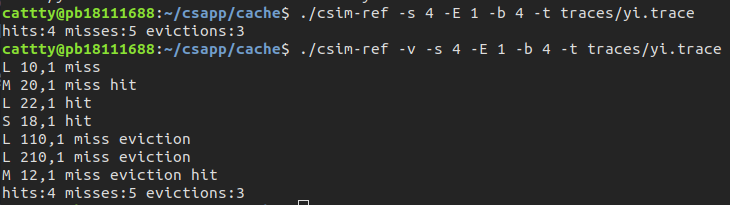
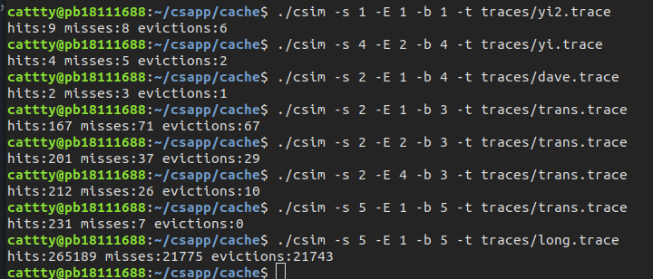
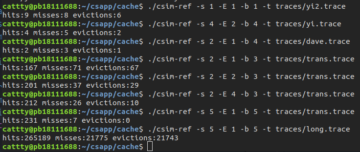

## cache lab
### part A
这部分主要是要求写一个c程序模拟cache的运行，要求最后效果与`csim-ref`文件的执行效果一致。先看一下这个可执行文件大概的运行效果。
根据实验指导书，其命令行参数如下：

`Usage: ./csim-ref [-hv] -s <s> -E <E> -b <b> -t <tracefile>`
• -h: Optional help flag that prints usage info
• -v: Optional verbose flag that displays trace info
• -s \<s>: Number of set index bits (S = 2s is the number of sets) 
• -E \<E>: Associativity (number of lines per set)
• -b \<b>: Number of block bits (B = 2b is the block size)
• -t \<tracefile>: Name of the valgrind trace to replay  

用实验指导中给出的指令进行测试，效果如下：  

下面开始试图用c程序编写实现。 
### 实验过程 
#### 命令行解析
这个函数的首要任务就是对命令行进行处理，以实现命令行参数的功能，查找资料，可以使用命令行处理函数`getopt`，其原型为
```c
nt getopt(int argc, char * const argv[], const char *optstring);
extern char *optarg; 
```
这里我们可以用到的外部变量是`optarg`，含义为指向下一个参数的指针。对照getopt的一些使用例子，可以将命令行处理部分进行如下编写：
```c
void cmdprocess(int argc, char* argv[])
{
    int opt;
    while ((opt = getopt(argc, argv, "hvs:E:b:t:")) != -1)
    {
        switch(opt){
            case 'h':
                fprintf(stdout, usage, argv[0]);
                exit(1);
            case 'v':
                verbose = 1;
                break;
            case 's':
                s = atoi(optarg);
                break;
            case 'E':
                E = atoi(optarg);
                break;
            case 'b':
                b = atoi(optarg);
                break;
            case 't':
                fp = fopen(optarg, "r");
                break;
            default:
                fprintf(stdout, usage, argv[0]);
                exit(1);
        }
    }
}
```

#### 模拟cache
首先我们需要为cache定义一个数据结构，根据输出需要用到的有
```c
typedef struct {
    int valid;  //有效位
    int tag;    //标记位
    int lru;    //least recently used
}cacheline;
typedef cacheline* cacheset;
typedef cacheSet* Cache;
```
定义好使用的数据结构之后,为cache开辟所需的空间。
```c
int S = pow(2, s);
    cache = (Cache)malloc(sizeof(cacheSet) * S);
    if (cache == NULL) return -1;
    for (int i = 0; i < S; i++)
    {
        cache[i] = (cacheSet)calloc(E, sizeof(cacheLine));
        if (cache[i] == NULL) return -1;
    }
```
z这一步对应在编译的时候遇到了一个问题，即`pow`函数在执行时报错，查找了相关资料后发现是由于以下原因,添加`-lm`后解决
> 使用math.h中声明的库函数还有一点特殊之处，gcc命令行必须加-lm选项，因为数学函数位于libm.so库文件中（这些库文件通常位于/lib目录下），-lm选项告诉编译器，我们程序中用到的数学函数要到这个库文件里找。
> 
下一步需要访问内存，这里我们可以将内存访问操作封装成一个函数方便使用。这里用注释进行说明。
```c
int visitCache(int address)
{
    //首先先确定cache中查找时的序号和tag值，计算后在根据这个查找
    int tag = address >> (s + b);
    int setIndex = address >> b & ((1 << s) - 1);
    int evict = 0;
    int empty = -1;
    cacheSet cacheset = cache[setIndex];

    for (int i = 0; i < E; i++){
        if (cacheset[i].valid){
            if (cacheset[i].tag == tag){  //行匹配成功，hit++
                hits++;       
                cacheset[i].lru = 1;
                return 0;
            }
            cacheset[i].lru++;
            if (cacheset[evict].lru <= cacheset[i].lru) 
                evict = i;
        }
        else
            empty = i;
    }
    //处理miss的情况，由于hit的已经返回了
    //需要注意miss这里应该进行分类讨论
    misses++;
    cacheset[empty].tag = tag;
    cacheset[empty].lru = 1;
    if (empty != -1){
        cacheset[empty].valid = 1;
        return 1;
    }
    else{
        evictions++;
        return 2;
    }
}
```
完成对访问cache的封装后剩下的部分就比较简单了，主要就是一些对输入的标准化处理，使用sscanf相关的指令就可以解决。 
编写开始的时候出现了一个小失误，即没有把`malloc`的内存`free`掉，通过其他的实验以及学习了解到这会发生内存泄漏，因此在最后需要`free(cache)`  
根据实验要求，为了完成实验的A部分，最后需要调用`printSummary`，因此使用
`printSummary(hits, misses, evictions);`
将需要的值输出，这里在第一次测试的时候报错，后来发现函数定义并没有包括在`cachelab.h`中，因此将其手动从`cachelab.c`中复制到`csim.c`中来。

#### 测试
在实验指导书中给出的8个测试一一进行测试。
  
  
上下分别是按要求编写的程序以及参考程序的执行结果，对比测试结果，通过测试。
