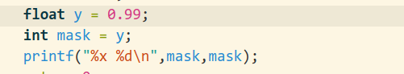
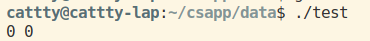
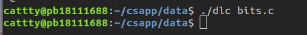
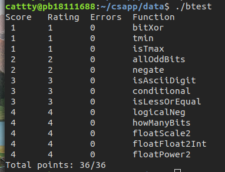

# 实验报告
## Data lab
#### 实验目的
修改`bits.c`文件，使其满足实验要求。
#### 1.Modifying bits.c and checking it for compliance with dlc
###### bitXor(x,y)
功能：求两个数按位异或
由于只有两个数进行异或运算，因此只有当两个数分别为0和1时才为1，即两个数`or`计算为1但`and`不为1  
因此我们可以用如下方式来表示
```c
return (~((~x) & (~y))) & (~(x & y))
```
由于单目运算的括号可以去掉，可以简化为
```c
return ~(~x & ~y) & ~(x & y)
```
###### tmin()
功能：返回补码最小的整数值  
对于32位的int型，需要返回一个最高位为1其余为0的值，可以用如下方式：
```c
return 1 << 31;
```
###### isTmax(x)
功能：如果x是以补码表示的最大的数则返回1反之为0
由于x是int型，其对应的最大值的补码形式为`0x7fff_ffff`，由于c语言并没有缩位运算，则需要对该数进行某种处理后使其正好为0之后再求非。可以用如下的代码得到0：
```c
x = x + x + 1; // 0x7fff_ffff + (0x1000_0000)
x = ~x;
```
带几个特殊值之后发现-1的补码经过同样的计算后有相同的结果，因此考虑使用-1对应补码取反后为0的将其排除，但不幸的是`0x7fffffff`取反后也是0，因此使用+1为0的特性，且使用逻辑运算（否则仍无法分开），最终得到
```c
int y = x + 1;
int z = ~(x + y);
int w = !y;   //防止0xffffffff
return !(z + w);
```
###### allOddBits(x)
说明：当奇数位均为1时返回1，反之为0  
由于是奇数位均为1，考虑左移1位之后相加的全为1再取反，由于末尾补0，因此再+1，这个操作同样可以避免偶数位全为1。最终为了避免和为`0x80000000`，再做一次逻辑运算。代码实现如下：
```c
int y = x << 1;
  y = ~(x + y + 1);
  return !y;
```
> 这里用btest测试后发现`0xffffffff`没有通过，经过查看后发现对题意理解有误orz，题目没有对偶数位进行要求，因此修改为
```c
int mask = 0xAA | (0xAA << 8);
  mask = mask | (mask << 16);
  return !((mask & x) ^ mask);
```
###### negate(x)
要求返回参数的相反数，根据补码知识，很容易得出：
```c
return ~x + 1;
```
###### isAsciiDigit(x)
说明：如果0x30 <= x <= 0x39（0-9对应ASCii值），返回1，否则返回0  
根据题意，即通过位操作实现减法性质的操作。这里对两个边界做差取符号位即可。
```c
    int mask = 1 << 31;
    int max = 0x39 + ~x + 1;
    int min = x + ~(0x30) + 1;
    max = (mask & max) >> 31;
    min = (mask & min) >> 31;
    return !(max|min);  
```
###### conditional(x,y,z)
说明：实现`x ? y : z`
这里只需要通过一次逻辑运算实现？的功能，之后将逻辑值转换成对应的掩码`0x11111111`或`0x00000000`即可。代码实现如下：
```c
x = ~(!x) + 1; //注意取非后是相反的，需要在return时体现
return (~x&y)|(x&z);
```
###### isLessOrEqual(x,y)
说明：如果x <= y返回1，否则为0
只需要通过补码做一次减法即可，在上面的`isAsciiDigit`部分已经实现过减法。
```c
    int mask = 1 << 31;
    x = y + ~x + 1;
    return !((mask & x) >> 31);
```
> 经过btest测试后发现对于0和最小数的处理有疏漏，因此优先进行符号判断，修改为
```c
int mask = 1 << 31;
  int cond1,cond2,cond3;
  cond2 = ((x >> 31) & 1) & !(y >> 31);
  cond3 = ((y >> 31) & 1) & !(x >> 31); //符号优先
  x = y + ~x + 1;
  cond1 = !((mask & x) >> 31);
  return (cond1 | cond2) & ~cond3;
```
###### logicalNeg(x)
说明：实现逻辑非
仅当为0时返回值为0，其余为1。只有0和`0x80000000`的取反＋1是自己而不是对应的相反数，而`0x80000000`的最高位为1，因此只有0和他的取反+1最高位都是0，利用这个性质，可以得到：
```c
    int mask = 1 ;
    return (~(x|~x + 1) >> 31 ) & mask;
``` 
特别注意，由于右移操作不改变符号，因此防止其余位的影响，最后应该用掩码1处理。
###### howManyBits(x)
* 未解决NaN的问题  
说明：计算一个数用补码最少需要几位表示  
从题面上看，这个函数的功能应该无法像前几个一样用较少的代码完成。由于必须要有一个符号位，因此只需要考虑其绝对值的情况，对于正数要找到符号位外从高到低第一个为1的位数，对于负数则需要找到第一个为0的位数，为了方便需要在一开始统一处理，将负数取反。
```c
int mask = x >> 31; //利用了算数位移的特性
x = (mask & ~x) | (~mask & x);
```
为了尽可能的快速完成查找过程，利用一个类似于二分查找（大概叫这个？）的思路，实现如下：
```c
int b0,b1,b2,b4,b8,b16;
b16 = !!(x >> 16) << 4;
x = x >> b16;
b8 = !!(x >> 8) << 3;
x = x >> b8;
b4 = !!(x >> 4) << 2;
x = x >> b4;
b2 = !!(x >> 2) << 1;
x = x >> b2;
b1 = !!(x >> 1);
x = x >> b1;
b0 = x;
return b0 + b1 + b2 + b4 + b8 + b16 +1;
```
* 该部分第一次在dlc测试中没有通过，报错`parse error`，后来通过尝试发现变量声明必须全放在最前面。
###### floatScale2(uf)
说明：参数和结果均为无符号整数，返回值为2*uf  
由于需要考虑浮点数有可能是规格化和非规格化两种情况，再加上NaN，需要用到条件语句。
```c
if((uf & 0x7f800000) == 0) //非规格化
    uf = ((uf & 0x007fffff) << 1) | (uf & 0x80000000);
else if((uf & 0x7f800000) != 0x7f800000) //规格化
    uf = uf + 0x00800000;
return uf;   //为NaN时原样返回
```
###### floatFloat2Int(uf)
说明：将单精度浮点数转换为对应的整数，NaN和无穷返回`0x80000000u`
由于参数和返回值均为无符号整型，同时浮点数和整数在负数的处理上并不同，需要进行转换，所以先用一个变量记录正负以及阶码和尾数：
```c
int sign = uf >> 31;  //由于uf是无符号数，这里只可能是0或1
int exp = ((uf & 0x7f800000) >> 23) - 127;
int frac = (uf & 0x007fffff) | 0x00800000;  //需要加上1
```
由于浮点数转换为整数涉及到舍的问题，这里首先处理几个特殊情况
为防止出错，我们用一个这样的测试程序验证转换机制。

结果如下，验证转换机制为直接舍去。

因此先处理一些特殊情况:
```c
if(exp < 0)
    return 0;
if(!(uf & 0x7fffffff))
    return 0;
if(exp > 31) //NaN or infinite
    return 0x80000000;
```
此时将frac对齐：
```c
if(exp > 23)
    frac = frac << (exp - 23);
else 
    frac = frac >> (23 - exp);
```
最后把负数以及由于指数较大溢出的情况处理一下：
```c
if(frac >> 31)
    return 0x80000000;
else if(sign)
    return ~frac + 1;
else 
    return frac;
```
###### floatPower2(x)
说明：计算2.0^x，返回的无符号整型实际上应该有符号位，如果结果太小，返回0，如果结果太大返回+infinite(`0x7f800000`)
该题目比较简单，直接按照规格化的单精度浮点数定义返回即可，由于规格化有一个默认的1，因此本题只需要移位。
#### 测试
首先使用dlc进行测试，发现没有报错，说明没有违规代码



接下来使用btest测试，在这里发生了一个插曲，初次`make btest`时报错`cannot find -lgcc`，使用网上搜到的重新安装、镜像建立软连接等方式均无法解决，最后终于意识到`make btest`时使用的指令为`gcc -m32`，考虑可能由于32位的gcc存在库依赖缺失问题，执行`sudo aot-get install gcc-multilib`后解决问题。


根据结果，所有测试全部通过。